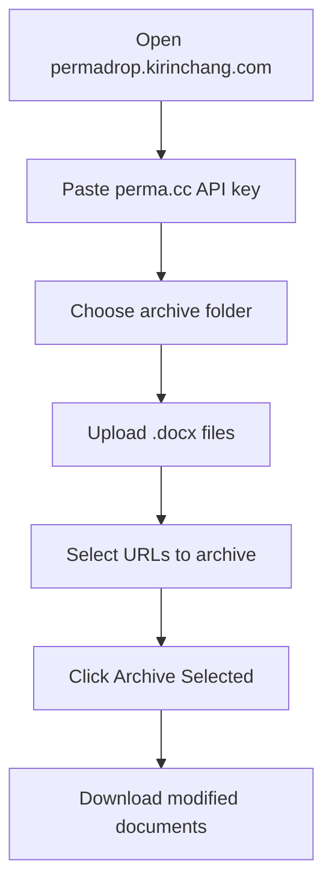
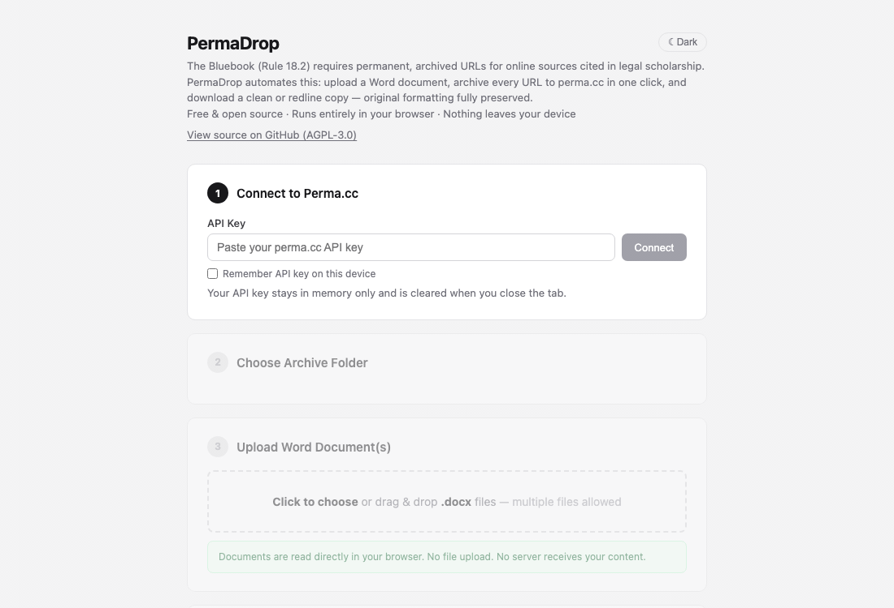

# PermaDrop

[繁體中文](README.zh-TW.md) | **English**

**Archive URLs in your Word documents to [perma.cc](https://perma.cc)** — creating permanent, tamper-proof links for legal citations.

🔗 **[permadrop.kirinchang.com](https://permadrop.kirinchang.com)**

---

## Why this exists

Legal scholars cite online sources constantly — court opinions, government documents, news articles, datasets. But URLs break. A link that works today may return a 404 tomorrow, taking your citation with it.

The Bluebook addresses this directly: **Rule 18.2 requires a permanent archived URL** (such as a perma.cc link) whenever you cite an internet source in legal scholarship. In practice, this means manually visiting perma.cc for every URL in your footnotes, copying the archive link, and pasting it back into your document — one by one, for dozens or hundreds of citations.

PermaDrop automates the entire process in one pass.

## What it does

PermaDrop scans your `.docx` files for every URL in footnotes, endnotes, and body text, archives them to perma.cc via the official API, and inserts the permanent links back into your document — available as a clean copy or a Track Changes redline. Original formatting is fully preserved.

No installation. No account beyond perma.cc. Just a [perma.cc API key](https://perma.cc/settings/tools).

## Features

- **Multiple files** — upload and process several `.docx` files at once
- **Clean or Redline** — download a submission-ready copy or a Track Changes version
- **CSV report** — export all URLs, perma.cc links, locations, and statuses
- **Smart detection** — existing perma.cc links in the document are flagged and skipped by default
- **Wayback Machine fallback** — if perma.cc capture fails, use an archived snapshot instead
- **Fully client-side** — your documents and API key never leave your browser

## How to use

1. Open [permadrop.kirinchang.com](https://permadrop.kirinchang.com)
2. Paste your [perma.cc API key](https://perma.cc/settings/tools)
3. Choose an archive folder
4. Upload one or more `.docx` files
5. Select the URLs you want to archive
6. Click **Archive Selected**
7. Download the modified document(s)

### Usage Flow Diagram

## Requirements

- A modern browser (Chrome, Firefox, Safari, Edge)
- A [perma.cc account](https://perma.cc/sign-up) with an API key

## Privacy

Your documents and API key are processed entirely in your browser. Nothing is uploaded to any server other than the perma.cc API itself.

## License

Copyright (C) 2026 [Kirin Chang](https://kirinchang.com)

Licensed under the [GNU Affero General Public License v3.0](LICENSE).  
If you modify this tool and run it as a network service, you must release your modified source code under the same license.
