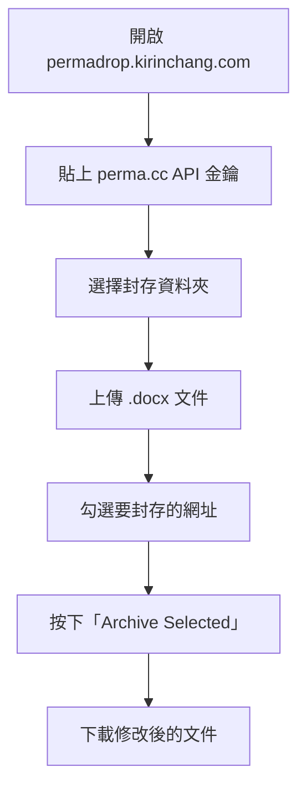

# PermaDrop

**繁體中文** | [English](README.md)

**將 Word 文件中的網址封存至 [perma.cc](https://perma.cc)** — 為法律引用建立永久、不可篡改的連結。

🔗 **[permadrop.kirinchang.com](https://permadrop.kirinchang.com)**

---

## 為什麼需要這個工具

法學學者在文章中大量引用網路資料來源——法院判決、政府文件、新聞報導、資料庫等。但網址會失效。今天還能開啟的連結，明天可能就變成 404，連帶讓整個引用失去依據。

《藍皮書》（The Bluebook）對此有明確規定：**第 18.2 條要求在引用網路資料來源時，必須附上永久封存網址**（例如 perma.cc 連結）。實務上，這意味著必須針對腳注中的每一個網址，逐一前往 perma.cc 封存、複製封存連結、再貼回文件——少則數十個，多則數百個，全程手動。

PermaDrop 將這整個流程自動化，一次完成。

## 功能說明

PermaDrop 掃描您的 `.docx` 文件，擷取腳注、尾注與本文中的所有網址，透過 perma.cc 官方 API 進行封存，並將永久連結自動插回文件中——提供乾淨版或修訂標記版（Track Changes）供下載，原始格式完整保留。

無需安裝，無需另外註冊帳號。只需一組 [perma.cc API 金鑰](https://perma.cc/settings/tools)。

## 功能特色

- **多檔案同時處理** — 可一次上傳並處理多個 `.docx` 文件
- **乾淨版或修訂版** — 下載可直接提交的乾淨版，或附 Track Changes 的修訂標記版
- **CSV 封存報告** — 匯出所有網址、perma.cc 連結、位置與狀態
- **智慧偵測** — 文件中既有的 perma.cc 連結會被標示並預設略過
- **Wayback Machine 備援** — 封存失敗時，可改用 Wayback Machine 的快照連結
- **完全本地端運算** — 文件與 API 金鑰不會離開您的瀏覽器

## 使用方式

1. 開啟 [permadrop.kirinchang.com](https://permadrop.kirinchang.com)
2. 貼上您的 [perma.cc API 金鑰](https://perma.cc/settings/tools)
3. 選擇封存資料夾
4. 上傳一個或多個 `.docx` 文件
5. 勾選要封存的網址
6. 按下「**Archive Selected**」開始封存
7. 下載修改後的文件

### 使用流程圖

## 使用需求

- 現代瀏覽器（Chrome、Firefox、Safari、Edge）
- [perma.cc 帳號](https://perma.cc/sign-up)及 API 金鑰

## 隱私說明

您的文件與 API 金鑰完全在瀏覽器本地處理，除 perma.cc API 本身外，不會傳送至任何伺服器。

## 授權條款

Copyright (C) 2026 [Kirin Chang](https://kirinchang.com)

本工具採用 [GNU Affero 通用公共授權條款第 3 版（AGPL-3.0）](LICENSE)。  
若您修改本工具並以網路服務形式提供，須以相同授權條款公開修改後的原始碼。
